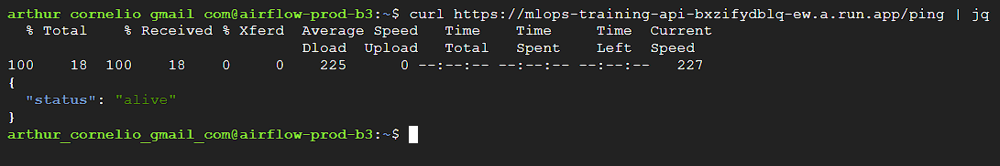
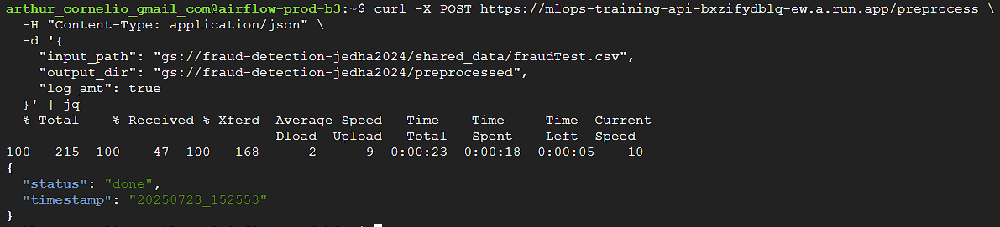
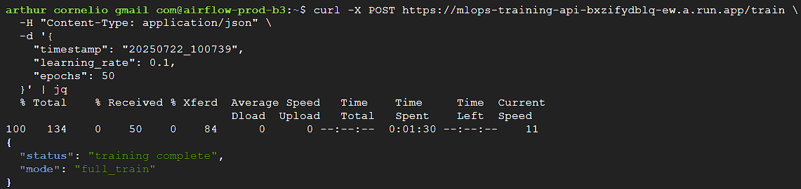
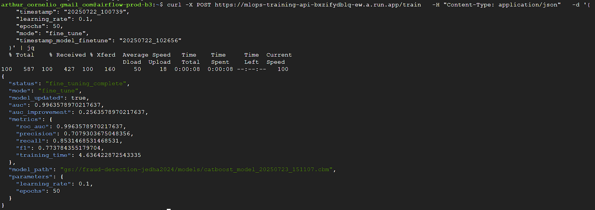
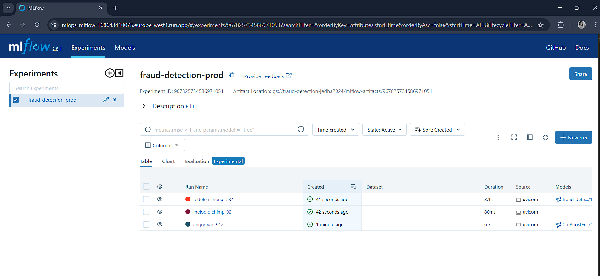
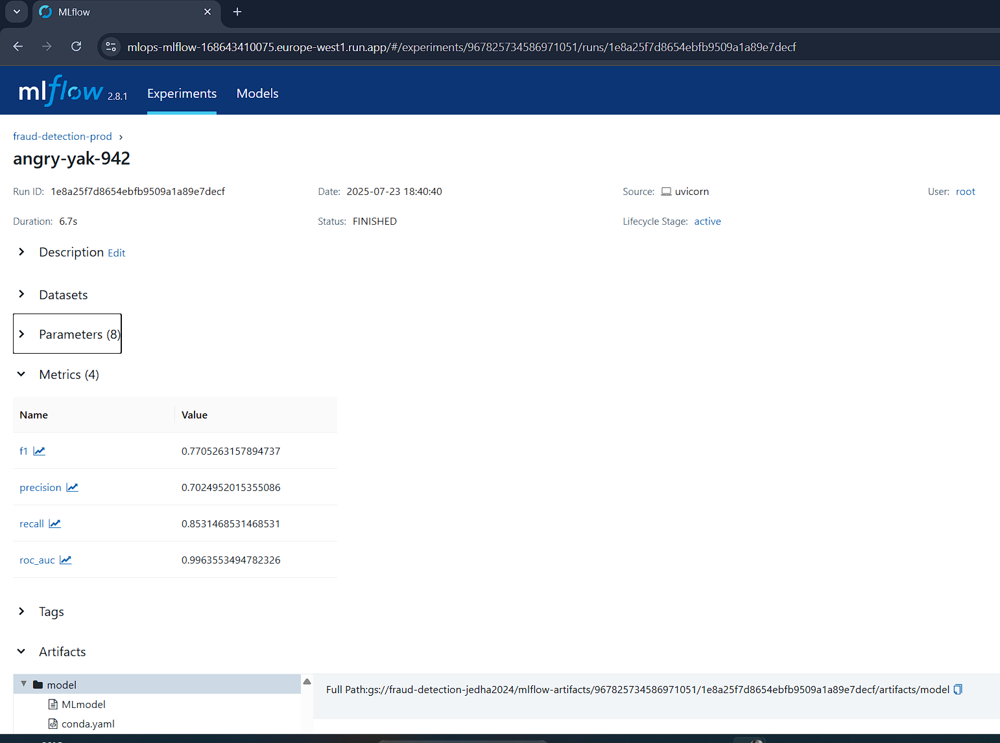
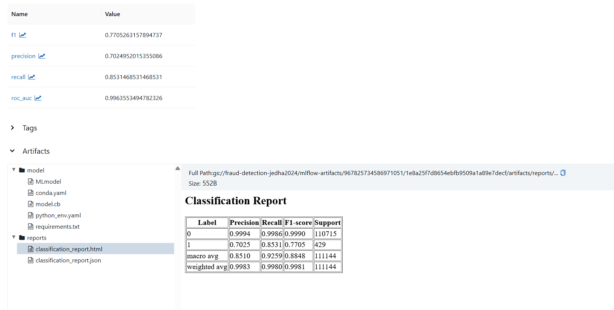
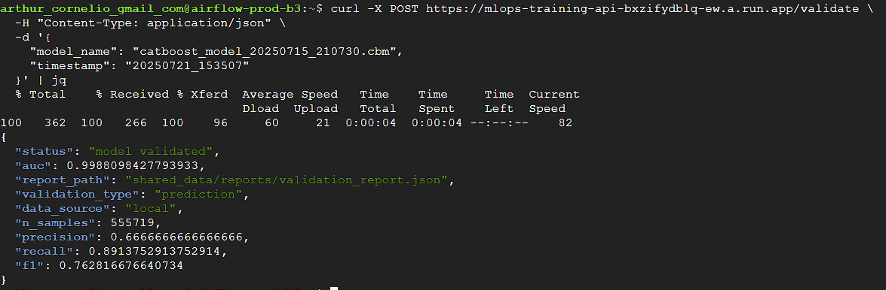
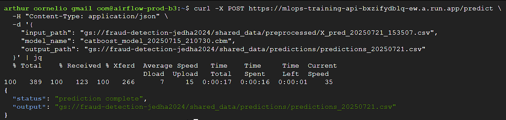
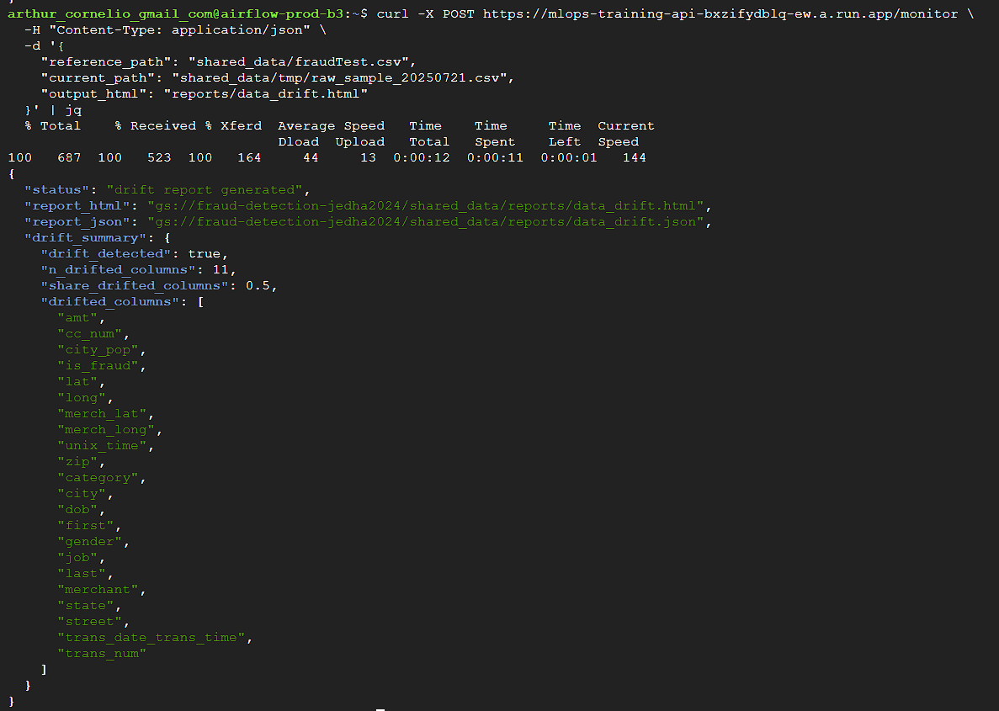

# 🚀 API Guide — Local & Production

**Last update: July 17, 2025**

---

## 📋 Table of Contents

1. [Starting the Services](#1-starting-the-services)
2. [Common Workflows](#2-common-workflows)
3. [Endpoints & Examples](#3-endpoints--examples)
4. [Monitoring & Debug](#4-monitoring--debug)
5. [Troubleshooting](#5-troubleshooting)
6. [Useful Resources](#6-useful-resources)

---

## 1. Starting the Services


### 🔹 Local Development

```bash
docker compose up --build
```

* **model-api**: [http://localhost:8000](http://localhost:8000)
* **mlflow**: [http://localhost:5000](http://localhost:5000)
* **mock-api**: [http://localhost:8001](http://localhost:8001)

Quick access:

* Swagger (API docs): [http://localhost:8000/docs](http://localhost:8000/docs)
* MLflow UI: [http://localhost:5000](http://localhost:5000)

---

### 🔹 In Production (Cloud Run)

The curl commands remain the same, just replace the URL (see table below).

| Service      | Local                                          | Production Cloud Run                                                                                     |
| ------------ | ---------------------------------------------- | -------------------------------------------------------------------------------------------------------- |
| Training API | [http://localhost:8000](http://localhost:8000) | [https://mlops-training-api-bxzifydblq-ew.a.run.app](https://mlops-training-api-bxzifydblq-ew.a.run.app) |
| Mock API     | [http://localhost:8001](http://localhost:8001) | [https://mlops-mock-api-bxzifydblq-ew.a.run.app](https://mlops-mock-api-bxzifydblq-ew.a.run.app)         |
| MLflow UI    | [http://localhost:5000](http://localhost:5000) | [https://mlops-mlflow-bxzifydblq-ew.a.run.app](https://mlops-mlflow-bxzifydblq-ew.a.run.app)             |

---


## 2. Common Workflows

### 🔄 **Standard Pipeline (dev & prod):**

0. **Health Check** 
1. **Transactions**
2. **Preprocess data**
3. **Train a model**
    - 3.1. **Fine-tune a model**
    - 3.2. **Tracking experiments in the deployed MLflow Server**
4. **Validate the model**
5. **Make predictions**
6. **Monitor drift**


---

### 0. 🏥 Health Check

```bash
# Model API
curl http://localhost:8000/ping
# or in production
curl https://mlops-training-api-bxzifydblq-ew.a.run.app/ping | jq

# Mock API
curl http://localhost:8001/ping
# or in production
curl https://mlops-mock-api-bxzifydblq-ew.a.run.app/ping | jq

# MLflow API (UI health, returns HTML)
curl http://localhost:5000
# or in production
curl https://mlops-mlflow-bxzifydblq-ew.a.run.app
```

**What to expect in the GCP VM terminal:**



---

### 1. Transactions endpoint (Mock API)

You can generate synthetic or real-like transactions using the mock API:

```bash
# Get 5 real transactions (variability=0)
curl "http://localhost:8001/transactions?n=5&variability=0" | jq
# or in production
curl "https://mlops-mock-api-bxzifydblq-ew.a.run.app/transactions?n=5&variability=0" | jq

# Get 10 synthetic transactions (variability=1)
curl "http://localhost:8001/transactions?n=10&variability=1" | jq
# or in production
curl "https://mlops-mock-api-bxzifydblq-ew.a.run.app/transactions?n=10&variability=1" | jq
```

> You can set variability between 0 (real) and 1 (fully synthetic)

**What to expect in the GCP VM terminal:**



### 2. 🔄 Preprocessing

**Local:**
```bash
curl -X POST http://localhost:8000/preprocess \
  -H "Content-Type: application/json" \
  -d '{
    "input_path": "/shared_data/fraudTest.csv",
    "output_dir": "/shared_data/preprocessed",
    "log_amt": true
  }' | jq
```

**Production:**

- Preprocessed dataset for predictions:

```bash
curl -X POST https://mlops-training-api-bxzifydblq-ew.a.run.app/preprocess \
  -H "Content-Type: application/json" \
  -d '{
    "input_path": "gs://fraud-detection-jedha2024/shared_data/fraudTest.csv",
    "output_dir": "gs://fraud-detection-jedha2024/preprocessed",
    "log_amt": true
  }' | jq
```


- Preprocessed dataset for full model training:

```bash
curl -X POST https://mlops-training-api-bxzifydblq-ew.a.run.app/preprocess \
  -H "Content-Type: application/json" \
  -d '{
    "input_path": "gs://fraud-detection-jedha2024/shared_data/fraudTest.csv",
    "output_dir": "gs://fraud-detection-jedha2024/preprocessed",
    "log_amt": true,
    "for_prediction": false
  }' | jq

```

**What to expect in the GCP VM terminal:**


---

### 3. 🤖 Training

**Local:**
```bash
curl -X POST http://localhost:8000/train \
  -H "Content-Type: application/json" \
  -d '{
    "timestamp": "20250721_153507",
    "learning_rate": 0.1,
    "epochs": 50
  }' | jq
```

**Production:**

- Full training: 

```bash
curl -X POST https://mlops-training-api-bxzifydblq-ew.a.run.app/train \
  -H "Content-Type: application/json" \
  -d '{
    "timestamp": "20250722_100739",
    "learning_rate": 0.1,
    "epochs": 50
  }' | jq
```

> "test": Default is `false`. If `true`, `X_raw` sample size = 5000 rows
> "fast": Default is `false`. If `true`, training params are set for fast training (worse metrics).


**What to expect in the GCP VM terminal:**




#### **3.1 Fine tuning:**

```bash
curl -X POST https://mlops-training-api-bxzifydblq-ew.a.run.app/train \
  -H "Content-Type: application/json" \
  -d '{
    "timestamp": "20250722_100739",
    "learning_rate": 0.1,
    "epochs": 50,
    "mode": "fine_tune",
    "timestamp_model_finetune": "20250722_102656"
  }' | jq
```


> Takes the last model and fine-tunes it with your selected data. If you want to fine-tune a specific model, use the `timestamp_model_finetune` parameter.

* Response: Metrics + model path.


**What to expect in the GCP VM terminal:**



---

#### 3.2 Access MLflow UI:

- Local: http://localhost:5000
- Production: https://mlops-mlflow-bxzifydblq-ew.a.run.app

**How to use the MLflow UI:**

  1. Experiments Tab:
      - See all experiments (e.g., "fraud_detection_experiment").
      - Click on an experiment to see all runs.



  2. Runs Table:
      - Each run corresponds to a training or fine-tuning job.
      - Click a run to see parameters, metrics, and artifacts.


  
  3. Artifacts Tab:
      - Download model files, reports, and other outputs.
      - The artifact storage backend is on GCP (see MLFLOW_TRACKING_URI in your environment).

TODO 

> **Tip:** If you see a GCS path in the artifact location, it means your MLflow backend is using Google Cloud Storage for artifact persistence.

---

### 4. 🔍 Validation

**Local:**
```bash
curl -X POST http://localhost:8000/validate \
  -H "Content-Type: application/json" \
  -d '{
    "model_name": "catboost_model_20250715_210730.cbm",
    "timestamp": "20250715_195232"
  }' | jq
```

**Production:**
```bash
curl -X POST https://mlops-training-api-bxzifydblq-ew.a.run.app/validate \
  -H "Content-Type: application/json" \
  -d '{
    "model_name": "catboost_model_20250715_210730.cbm",
    "timestamp": "20250721_153507"
  }' | jq
```


**What to expect in the GCP VM terminal:**


---

### 5. 🔮 Prediction

**Local:**
```bash
curl -X POST http://localhost:8000/predict \
  -H "Content-Type: application/json" \
  -d '{
    "input_path": "/shared_data/preprocessed/X_pred_20250715_195232.csv",
    "model_name": "catboost_model_20250715_210730.cbm",
    "output_path": "/shared_data/predictions/predictions_20250715.csv"
  }' | jq
```

**Production:**
```bash
curl -X POST https://mlops-training-api-bxzifydblq-ew.a.run.app/predict \
  -H "Content-Type: application/json" \
  -d '{
    "input_path": "gs://fraud-detection-jedha2024/shared_data/preprocessed/X_pred_20250721_153507.csv",
    "model_name": "catboost_model_20250715_210730.cbm",
    "output_path": "gs://fraud-detection-jedha2024/shared_data/predictions/predictions_20250721.csv"
  }' | jq
```


**What to expect in the GCP VM terminal:**



---

### 6. 📊 Monitoring (Data Drift)

**Local:**
```bash
curl -X POST http://localhost:8000/monitor \
  -H "Content-Type: application/json" \
  -d '{
    "reference_path": "data/processed/X_test_20250715_195232.csv",
    "current_path": "data/processed/X_pred_20250715_195232.csv",
    "output_html": "reports/data_drift.html"
  }' | jq
```

**Production:**
```bash
curl -X POST https://mlops-training-api-bxzifydblq-ew.a.run.app/monitor \
  -H "Content-Type: application/json" \
  -d '{
    "reference_path": "shared_data/fraudTest.csv",
    "current_path": "shared_data/tmp/raw_sample_20250721.csv",
    "output_html": "reports/data_drift.html"
  }' | jq
```


* Response: drift summary, HTML report path.

**What to expect in the GCP VM terminal:**


---

## 4. Monitoring & Debug

* **Swagger**:
  * Local: [http://localhost:8000/docs](http://localhost:8000/docs)
  * Prod: [https://mlops-training-api-bxzifydblq-ew.a.run.app/docs](https://mlops-training-api-bxzifydblq-ew.a.run.app/docs)
* **MLflow UI**:
  * Local: [http://localhost:5000](http://localhost:5000)
  * Prod: [https://mlops-mlflow-bxzifydblq-ew.a.run.app](https://mlops-mlflow-bxzifydblq-ew.a.run.app)

**Cloud Run Logs**:

```bash
gcloud run services logs tail mlops-training-api --region=europe-west1
```

---

### **Practical Notes**

* Paths:
  * Local: `/app/shared_data/...` or `data/processed/...`
  * Prod: `gs://...`
* Environment variables: see local `.env` and GCP secrets for production
* Authentication:
  * Dev: credential files must be placed locally
  * Prod: Cloud Run is deployed with `--allow-unauthenticated` (should be hardened for real production)